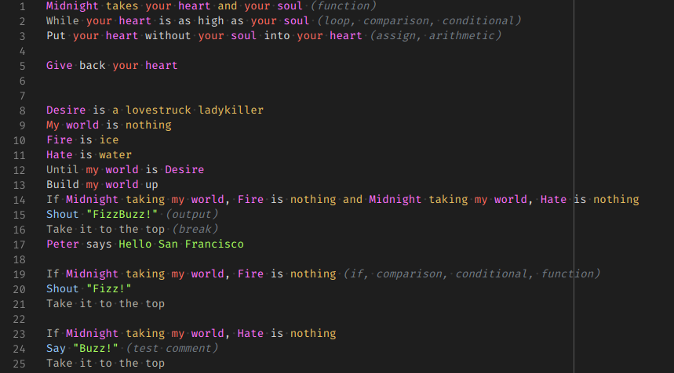

# Rockstar syntax highlighting package for VSCode

VSCode syntax grammar for the [Rockstar programming language](https://github.com/dylanbeattie/rockstar) for all of you Rockstar developers out there.

## Features

Syntax higlighting.

## Missing

- proper variables highlight
- other issues I didn't notice

## Credits

Based on [thestd](https://github.com/thestd/language-rockstar)

## License

This code is licensed under the [MIT License](LICENSE).
